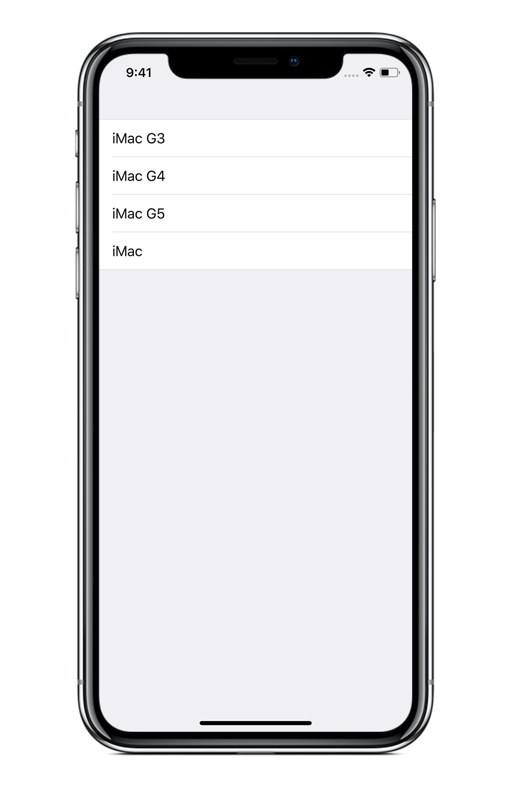

# TableViewDataSource

Modular architecture for creating beautiful UI with table views.

The **TableViewDataSource** framework utilize composition to break complex data source classes into small components.

General idea is described in my blog post about object composition in Swift: [App Architecture and Object Composition in Swift](https://medium.com/flawless-app-stories/app-architecture-and-object-composition-in-swift-c9101a9e37e3).

The **TableViewDataSource** framework is inspired by [Advanced User Interfaces with Collection Views](https://developer.apple.com/videos/play/wwdc2014/232/) WWDC session.

- [Example](#example)
    + [Basic Approach](#basic-approach)
    + [Composition Approach](#composition-approach)
- [Usage](#usage)
- [License](#license)

## Example

The **TravelGuide** app used to demonstrate key features of the **TableViewDataSource** framework. The app displays information about a city. UI contains list of places in a city and the *"Read More"*/*"Read Less"* button. `UITableView` works great for this kind of UI because we have repeated list of elements. 


### Basic Approach

Typical approach would be implementing `UITableViewDataSource` in a view controller.

We can organize our content in sections:
- header with city image and title;
- welcome message and detail text;
- the list of places.

The header section is static, containing only fixed number of rows. The welcome and detail section can contain extended text, hidden by default. The list of places is dynamic, displaying hierarchical information, with every group in a separate section.

Not only we have a mix of static and dynamic content, visibility of some content depends on user interaction.

We can have an object describing sections and an array of visible sections.

```swift
// CityViewController.swift

/// Define for sections in the table view
private enum SectionType {

    case header

    case welcomeAndDetail

    /// Places are grouped and every group is displayed in separate section.
    /// The groupIndex associated value is used to access group in the list.
    case places(groupIndex: Int)
}

/// Currently visible sections in the table view.
/// .header and .welcomeAndDetail are static, .places are mapped from the list in a model.
var visibleSections: [SectionType] = [ .header, .welcomeAndDetail ]
    + model.placeGroups.enumerated().map { .places(groupIndex: $0.0) }

```

Our implementation will also need some way to map index path in the table view. Switch statement works well for a simple example:

```swift
func tableView(_ tableView: UITableView, cellForRowAt indexPath: IndexPath) -> UITableViewCell {
    switch visibleSections[indexPath.section] {
        case .header:
            // ...

        case .welcomeAndDetail:
            // ...

        case .places(let groupIndex):
            // ...
    }
}
```

This mapping will be necessity wherever we use index path or section. Basically, any interaction with the table view, data source and delegate implementations. When we need to change structure of the table view, we need to change mapping as well. Needless to say, reusing parts of the table view on other screens requires implementing separate mapping.

As you can see, implementing `UITableViewDataSource` is challenging. 

### Composition Approach

Let's analyze why implementing complex UI with `UITableView` is challenging.

Is the API complicated? Table view requires number of sections/rows and cell for every row, not more than that. Table view is one of the most commonly used UI elements. API is simple and well known.

Is our approach complicated? Here we have a simple define for sections, and we can make similar for rows. Mapping code uses basic switch statement. We can always do better 😊, but this is very simple approach.

We have a complex problem and we need to break it down into smaller subproblems. This is where composition will help.

Let's organize our content in separate data sources. The `TableViewDataSource` is the base class for objects implementing `UITableViewDataSource` protocol.

```swift
/// Data source for the header with city image and title
class HeaderDataSource: TableViewDataSource {

    override func tableView(_ tableView: UITableView, numberOfRowsInSection section: Int) -> Int {
        // ...
    }

    override func tableView(_ tableView: UITableView, cellForRowAt indexPath: IndexPath) -> UITableViewCell {
        // ...
    }
}

/// Data source for the welcome message and detail text
class DetailDataSource: TableViewDataSource {

    override func tableView(_ tableView: UITableView, numberOfRowsInSection section: Int) -> Int {
        // ...
    }

    override func tableView(_ tableView: UITableView, cellForRowAt indexPath: IndexPath) -> UITableViewCell {
        // ...
    }
}

/// Data source for the list of places
class PlacesDataSource: TableViewDataSource {

    override func tableView(_ tableView: UITableView, numberOfRowsInSection section: Int) -> Int {
        // ...
    }

    override func tableView(_ tableView: UITableView, cellForRowAt indexPath: IndexPath) -> UITableViewCell {
        // ...
    }
}

```

When subclassing `TableViewDataSource` we use `UITableViewDataSource` API as is. And instead of having one large data source, we break it into three small data sources. Our view controller will now serve to build the composite and configure the table view.

```swift
// CityViewController.swift

var dataSource: CompositeTableViewDataSource?

func viewDidLoad() {
    super.viewDidLoad()

    dataSource = CompositeTableViewDataSource([
        HeaderDataSource(), DetailDataSource(), PlacesDataSource()
    ])

    dataSource?.configure(with: tableView)
}

```

The **TableViewDataSource** framework takes care of composing and mapping. We can focus on implementing parts of our UI and configure final data source the way we want. Reusing parts of the table view on other screens is now as simple, as import a file with a data source.

Full example is in the repository, demonstrating how to use the **TableViewDataSource** framework with storyboards, XIB's, and programmatically build UI.

## Usage

The simplest way to implement data source is subclassing `TableViewDataSource` class.

```swift
// IMacDataSource.swift

import UIKit
import TableViewDataSource


class IMacDataSource: TableViewDataSource {

    let names = [ "iMac G3", "iMac G4", "iMac G5", "iMac" ]

    override func registerReusableViews(with tableView: UITableView) {
        tableView.register(UITableViewCell.self, forCellReuseIdentifier: "Cell")
    }

    override func tableView(_ tableView: UITableView, numberOfRowsInSection section: Int) -> Int {
        return names.count
    }

    override func tableView(_ tableView: UITableView, cellForRowAt indexPath: IndexPath) -> UITableViewCell {
        let cell = tableView.dequeueReusableCell(withIdentifier: "Cell", for: indexPath)
        cell.textLabel?.text = names[indexPath.row]

        return cell
    }
}
```

The view controller loads view and configures the data source.

```swift
// ViewController.swift

import UIKit


class ViewController: UIViewController {

    @IBOutlet weak var tableView: UITableView!

    private let dataSource = IMacDataSource()

    override func viewDidLoad() {
        super.viewDidLoad()
        dataSource.configure(with: tableView)
    }
}
```

Alternative approach is to conform to the `TableViewDataSourceType` protocol when subclassing is not convenient.



Let's create one more data source. 

```swift
// MacOSDataSource.swift

import UIKit
import TableViewDataSource


class MacOSDataSource: TableViewDataSource {

    let generations = [
        [ "Kodiak" ],
        [ "Cheetah", "Puma", "Jaguar", "Panther", "Tiger", "Leopard", "Snow Leopard", "Lion", "Mountain Lion" ],
        [ "Mavericks", "Yosemite", "El Capitan", "Sierra", "High Sierra"]
    ]

    override var numberOfSections: Int {
        return generations.count
    }

    override func registerReusableViews(with tableView: UITableView) {
        tableView.register(UITableViewCell.self, forCellReuseIdentifier: "Cell")
    }

    override func tableView(_ tableView: UITableView, numberOfRowsInSection section: Int) -> Int {
        return generations[section].count
    }

    override func tableView(_ tableView: UITableView, cellForRowAt indexPath: IndexPath) -> UITableViewCell {
        let cell = tableView.dequeueReusableCell(withIdentifier: "Cell", for: indexPath)
        cell.textLabel?.text = generations[indexPath.section][indexPath.row]

        return cell
    }
}
```

The view controller builds composition using `CompositeTableViewDataSource` class.

```swift
// ViewController.swift

import UIKit
import TableViewDataSource


class ViewController: UIViewController {

    @IBOutlet weak var tableView: UITableView!

    private let dataSource = CompositeTableViewDataSource([
        IMacDataSource(), MacOSDataSource()
    ])

    override func viewDidLoad() {
        super.viewDidLoad()
        dataSource.configure(with: tableView)
    }
}
```


## License

The **TableViewDataSource** framework framework is released under the MIT license. See LICENSE for details.


